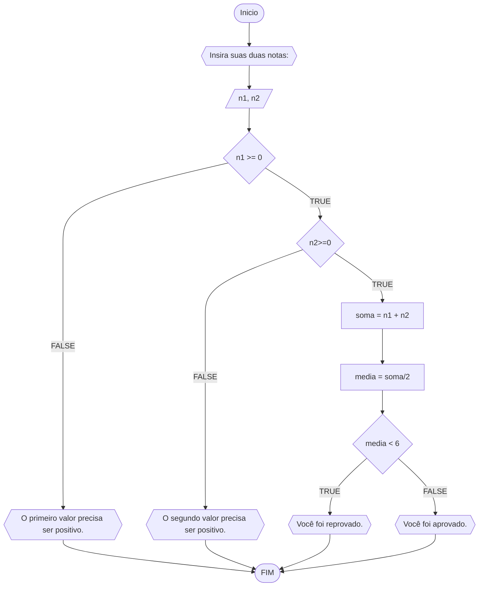
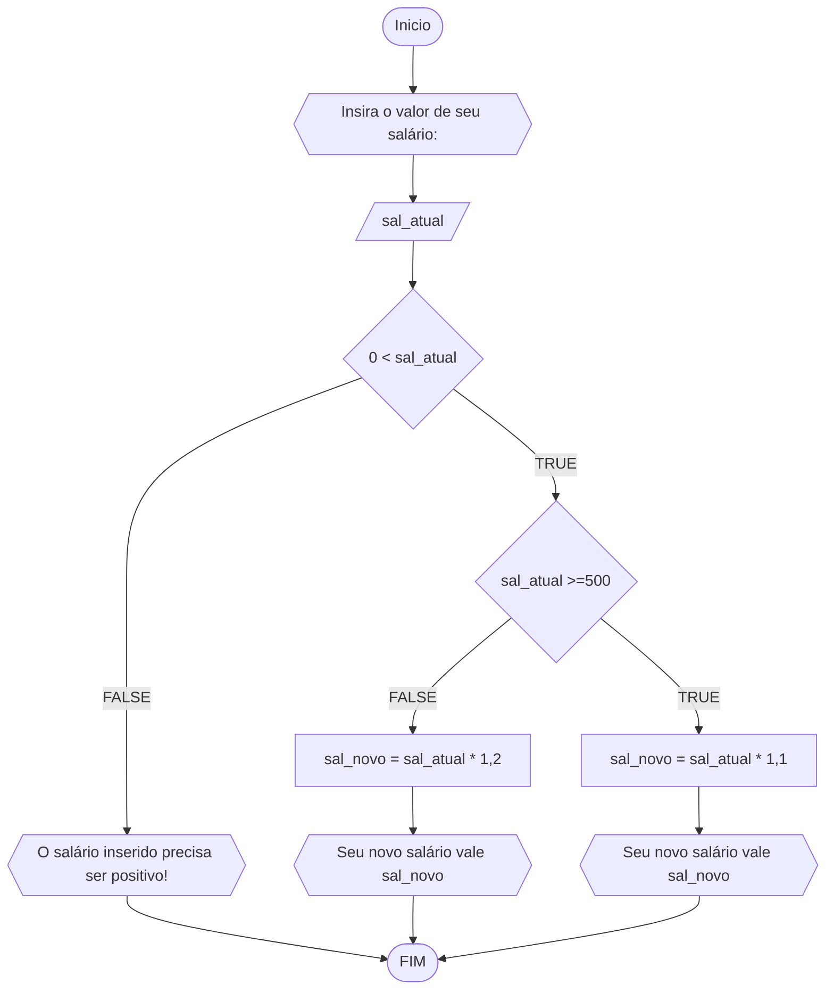
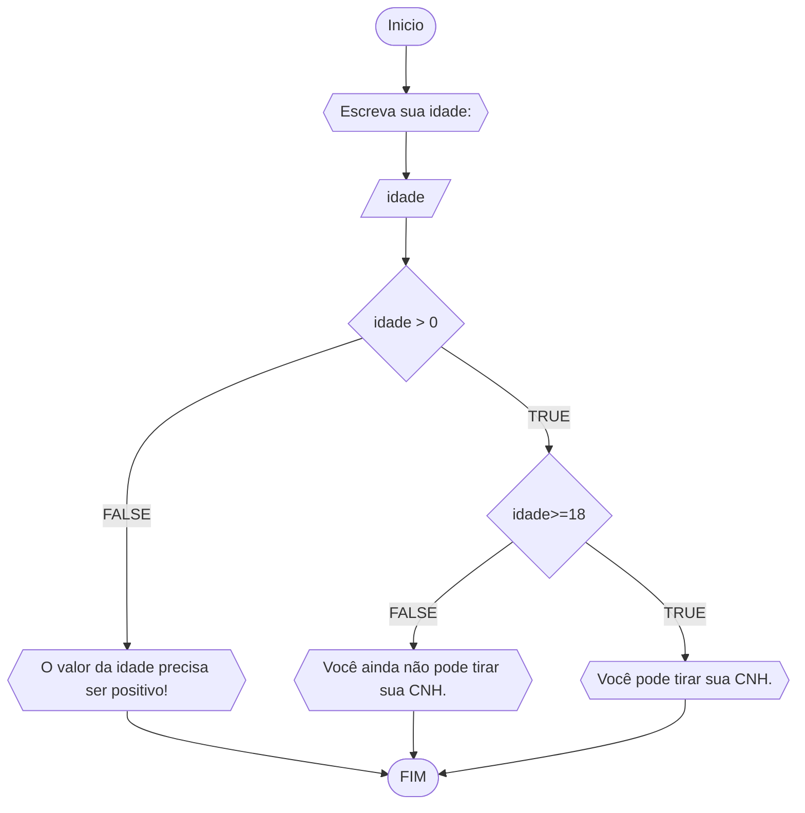

# UNIFOR
**Disciplina:** Raciocínio lógico algorítmico <br>
**Orientador:** Prof. Ricardo Carubbi

## Lista 1 de exercícios:

### Exercício 1:

Represente, em fluxograma e pseudocódigo, um algoritmo para calcular a média aritmética entre duas notas de um aluno e mostrar sua situação, que pode ser aprovado ou reprovado;

##### Fluxograma:


##### Pseudocódigo:

```
ALGORITMO media
DECLARE n1, n2, soma, media INTEIRO
ESCREVA "Insira suas duas notas: "
LEIA n1, n2
SE n1 >= 0 ENTAO
	SE n2 >= 0 ENTAO
		soma = n1 + n2
		media = soma / 2
		SE media < 6 ENTAO
			ESCREVA "Reprovado!"
		SENAO
			ESCREVA "Aprovado!"
	SENAO
		ESCREVA "O segundo número precisa ser positivo!"
SENAO
	ESCREVA "O primeiro número precisa ser positivo!"

FIM
```

### Exercício 2:

Represente, em fluxograma e pseudocódigo, um algoritmo para calcular o novo salário de um funcionário. Sabe-se que os funcionários que recebem atualmente salário de até R$ 500 terão aumento de 20%; os demais terão aumento de 10%.

##### Fluxograma:



##### Pseudocódigo:

```
ALGORITMO aumento_salarial
DECLARE sal_atual, sal_novo FLOAT
ESCREVA "Insira o valor de seu salário: "
LEIA sal_atual
SE sal_atual > 0 ENTAO
	SE sal_atual >= 500 ENTAO
		sal_novo = sal_atual * 1,1
		ESCREVA "Seu novo salário vale: {sal_novo}!"
	SENAO
		sal_novo = sal_atual * 1,2
		ESCREVA "Seu novo salário vale: {sal_novo}!"
SENAO
	ESCREVA "O salário inserido precisa ser positivo!"

FIM
```

### Exercício 3:

Represente, em fluxograma e pseudocódigo, um algoritmo para determinar se um número **inteiro** e **positivo** é par ou impar.

##### Fluxograma:


##### Pseudocódigo:

```
ALGORITMO verifica_par_impar
DECLARE n1, resto INTEIRO
ESCREVA "Insira um numero inteiro positivo: "
LEIA n1
SE n1 > 0 ENTAO
	resto = n1 % 2
	SE resto == 0 ENTAO
		ESCREVA "O número é par!"
	SENAO
		ESCREVA "O número é impar!"
SENAO
	ESCREVA "O número deve ser positivo!"

FIM
```

### Exercício 4:

Represente, em fluxograma e pseudocódigo, um algoritmo que, a partir da idade do candidato(a), determinar se pode ou não tirar a CNH. Caso não atender a restrição de idade, calcular quantos anos faltam para o candidato estar apto.

#### Fluxograma:



##### Pseudocódigo:

```
ALGORITMO CNH
DECLARE idade
ESCREVA "Digite sua idade: "
LEIA idade
SE idade > 0 ENTAO
	SE idade >= 18 ENTAO
		ESCREVA "Você está pode tirar sua CNH."
	SENAO
		ESCREVA "Você não pode tirar sua CNH."
SENAO
	ESCREVA "O valor da idade precisa ser positivo!"

FIM
```
