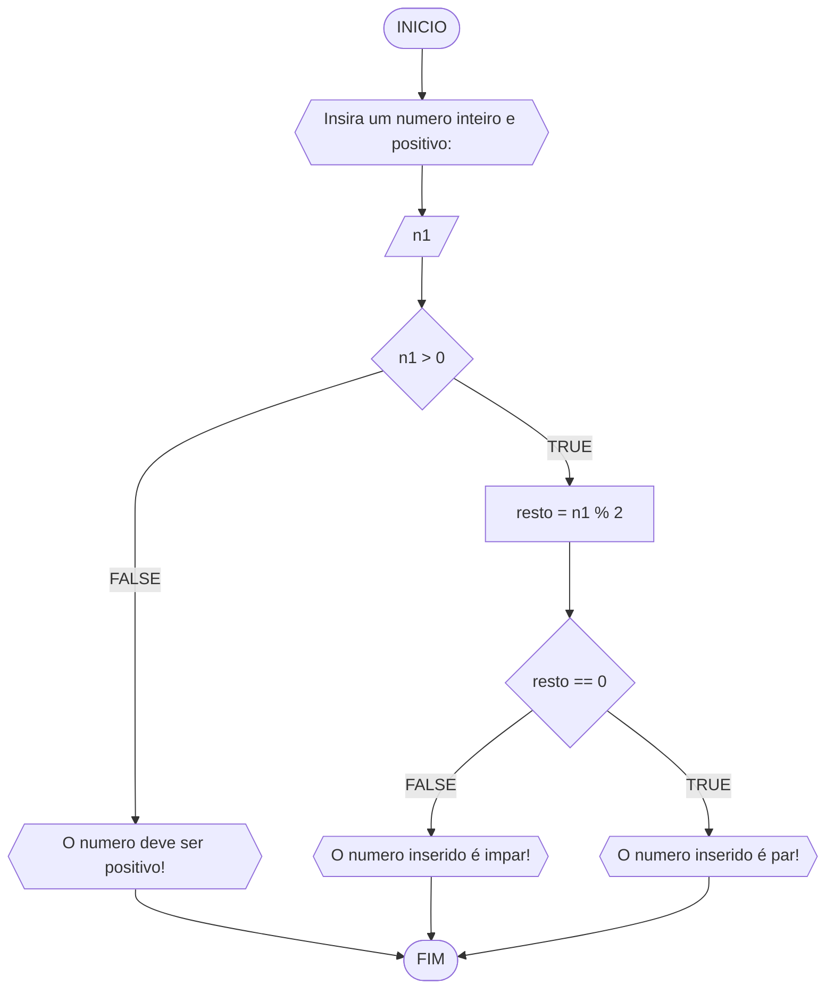

# UNIFOR
**Disciplina:** Raciocínio lógico algorítmico <br>
**Orientador:** Prof. Ricardo Carubbi

## Lista 1 de exercícios:

### Exercício 3:

Represente, em fluxograma e pseudocódigo, um algoritmo para determinar se um número **inteiro** e **positivo** é par ou impar.

##### Fluxograma:


```
ALGORITMO verifica_par_impar
DECLARE n1, resto INTEIRO
ESCREVA "Insira um numero inteiro positivo: "
LEIA n1
SE n1 > 0 ENTAO
	resto = n1 % 2
	SE resto == 0 ENTAO
		ESCREVA "O número é par!"
	SENAO
		ESCREVA "O número é impar!"
SENAO
	ESCREVA "O número deve ser positivo!"

FIM
```

