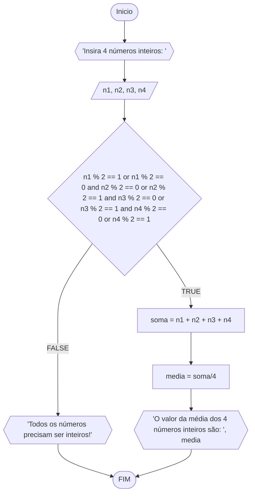
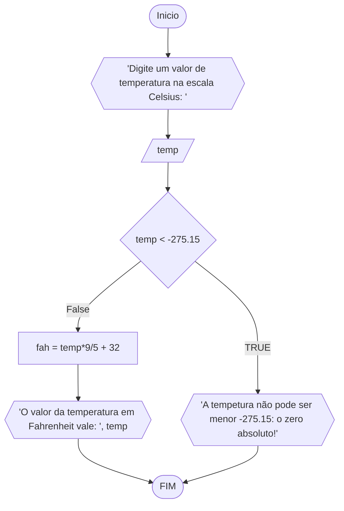
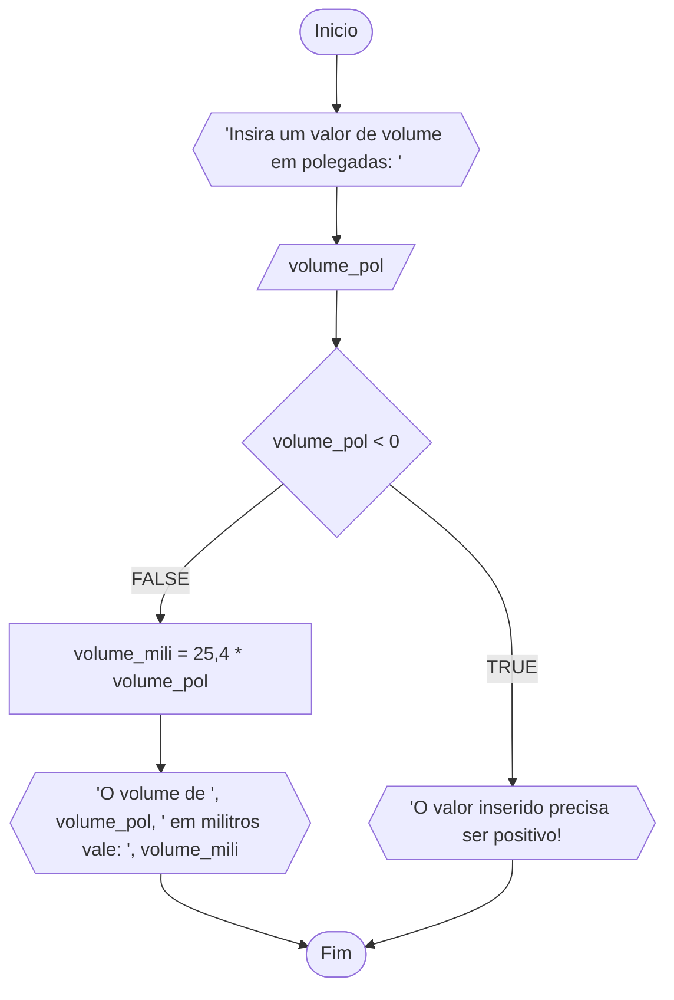
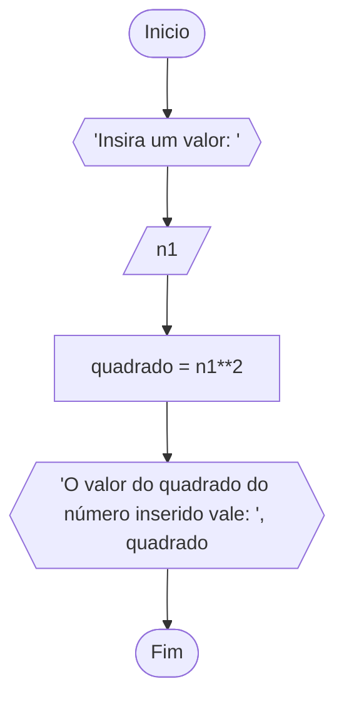
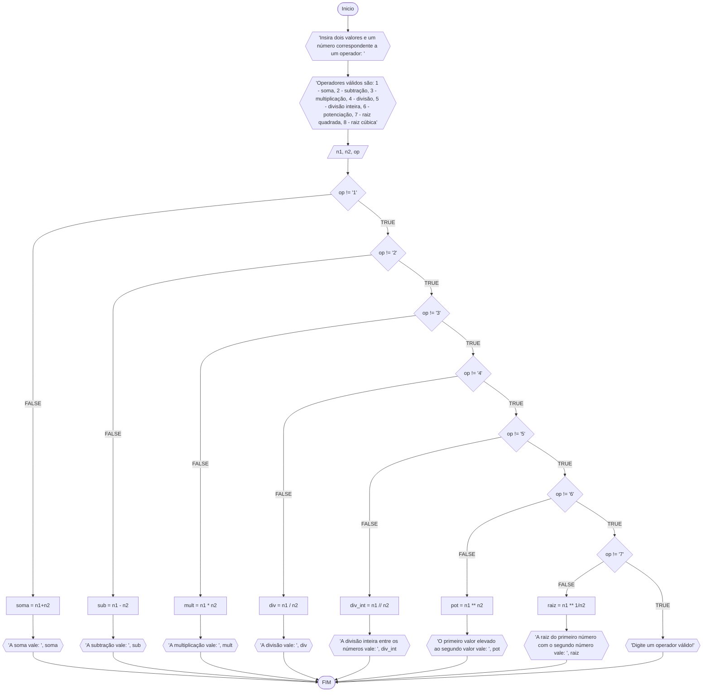

# Unifor

### Exerício 1:
Calcule a média de quatro números inteiros dados.

##### Fluxograma:



##### Pseudocódigo:

```
ALGORITMO Media_4_notas
ESCREVA "Insira 4 números inteiros: "
DECLARE n1, n2, n3, n4: inteiro

INICIO
  LEIA n1, n2, n3, n4
  SE n1 % 2 == 1 or n1 % 2 == 0 and n2 % 2 == 0 or n2 % 2 == 1 and n3 % 2 == 0 or n3 % 2 == 1 and n4 % 2 == 0 or n4 % 2 == 1 ENTAO
    soma = n1+n2+n3+n4
    media = soma / 4
    ESCREVA "A sua média vale", media
  SENAO
    ESCREVA "Todos os números precisam ser inteiros!"
  FIM_SE
FIM
```

### Exercício 2:
Leia uma temperatura dada na escala Celsius (C) e imprima o equivalente em Fahrenheit (F). (Fórmula de conversão: F = (9/5) * C + 32)

#### Fluxograma:



### Exercício 3:

Leia uma quantidade de chuva dada em polegadas e imprima o equivalente em milímetros (25,4 mm = 1 polegada).

#### Fluxograma:



#### Exercício 4:

O custo ao consumidor de um carro novo é a soma do custo de fábrica com a porcentagem do distribuidor e dos impostos, ambos aplicados ao custo de fábrica. Supondo que a porcentagem do distribuidor seja de 12% e a dos impostos de 45%, prepare um algoritmo para ler o custo de fábrica do carro e imprimir o custo ao consumidor.


### Exercício 5:
Calcule o quadrado de um número.

#### Fluxograma:



### Exercício 6:
O cardápio de uma lanchonete é dado abaixo. Prepare um algoritmo que leia a quantidade de cada item que você consumiu e calcule a conta final.
a) Hambúrguer................ R$ 3,00
b) Cheeseburger.............. R$ 2,50
c) Fritas.................... R$ 2,50
d) Refrigerante ............. R$ 1,00
e) Milkshake................. R$ 3,00

#### Fluxograma:


### Exercício 20:

Receba dois números reais e um operador (vide slide 9). e efetue a operação correspondente com os valores recebidos (operandos). O algoritmo deve retornar o resultado da operação selecionada simulando todas as opeações de uma calculadora simples.

##### Fluxograma:



