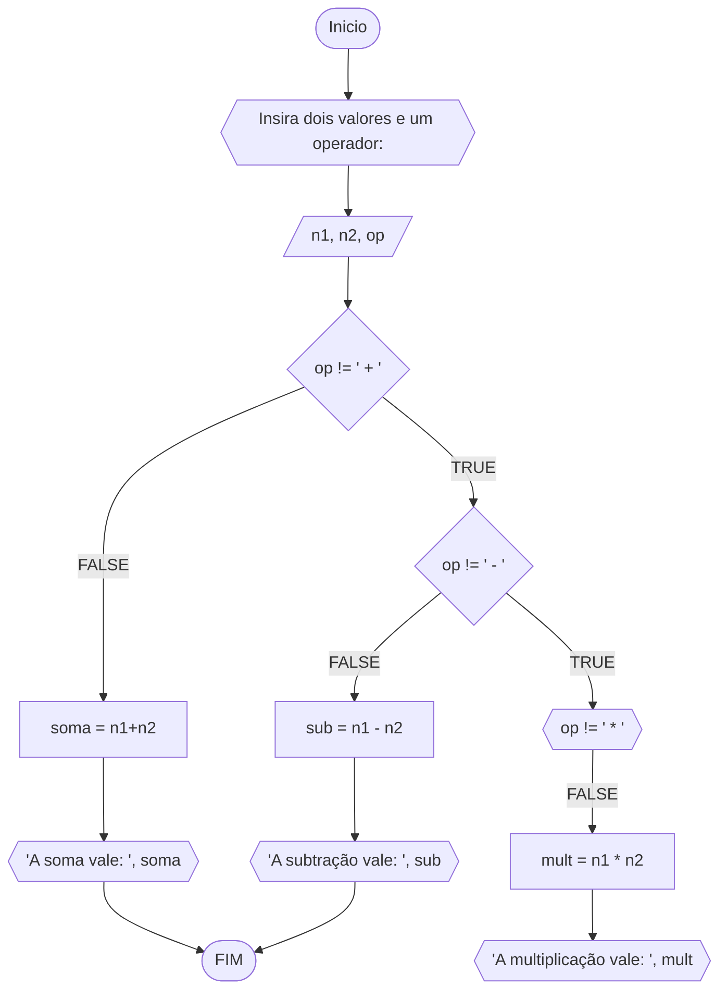

# Unifor

### Exercício 20:

```mermaid
flowchart TD
A([Inicio]) --> B{{Insira dois valores e um operador: }}
B --> C[/n1, n2, op/]

C --> D{op != ' + '}
D -- FALSE--> E[soma = n1+n2]
E --> F{{'A soma vale: ', soma}} --> ZZ

D --TRUE--> G{op != ' - '}
G --FALSE--> H[sub = n1 - n2]
H --> I{{'A subtração vale: ', sub}} --> ZZ

G --TRUE--> J{{op != ' * '}}
J --FALSE--> K[mult = n1 * n2]
K --> L{{'A multiplicação vale: ', mult}}


ZZ([FIM])


 

```

