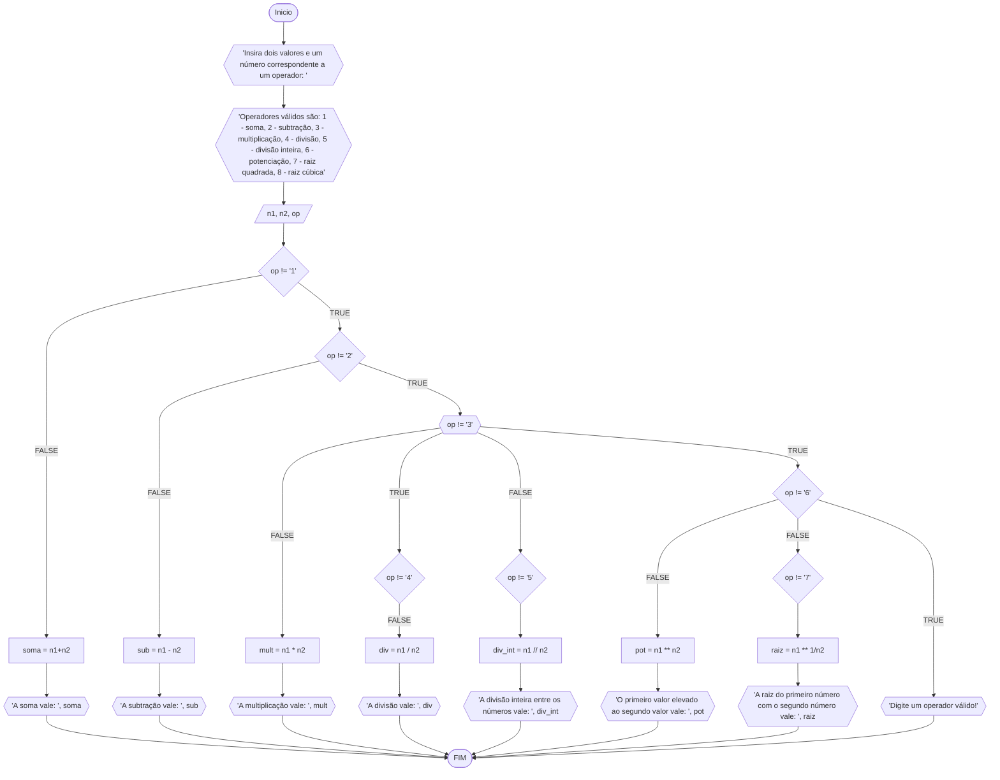

# Unifor

### Exercício 20:

```mermaid
flowchart TD
A([Inicio]) --> B{{'Insira dois valores e um número correspondente a um operador: '}}
B --> BB{{'Operadores válidos são: 1 - soma, 2 - subtração, 3 - multiplicação, 4 - divisão, 5 - divisão inteira, 6 - potenciação, 7 - raiz quadrada, 8 - raiz cúbica'}}
BB--> C[/n1, n2, op/]

C --> D{op != '1'}
D -- FALSE--> E[soma = n1+n2]
E --> F{{'A soma vale: ', soma}} --> ZZ

D --TRUE--> G{op != '2'}
G --FALSE--> H[sub = n1 - n2]
H --> I{{'A subtração vale: ', sub}} --> ZZ

G --TRUE--> J{{op != '3'}}
J --FALSE--> K[mult = n1 * n2]
K --> L{{'A multiplicação vale: ', mult}} --> ZZ

J --TRUE--> M{op != '4'}
M --FALSE--> N[div = n1 / n2]
N --> O{{'A divisão vale: ', div}} --> ZZ

J --FALSE--> P{op != '5'}
P --> Q[div_int = n1 // n2]
Q --> R{{'A divisão inteira entre os números vale: ', div_int}} --> ZZ

J --TRUE--> S{op != '6'}
S --FALSE--> T[pot = n1 ** n2]
T --> U{{'O primeiro valor elevado ao segundo valor vale: ', pot}} --> ZZ

S--FALSE--> V{op != '7'}
V --> W[raiz = n1 ** 1/n2]
W --> X{{'A raiz do primeiro número com o segundo número vale: ', raiz}} --> ZZ

S --TRUE--> Z{{'Digite um operador válido!'}} --> ZZ

ZZ([FIM])


 

```

