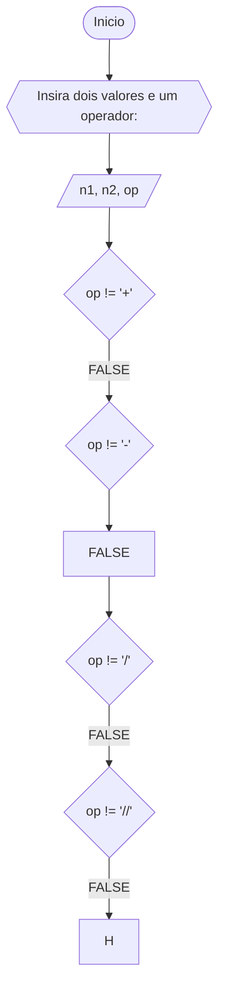

# Unifor

### Exercício 20:

```mermaid
flowchart TD
A([Inicio]) --> B{{Insira dois valores e um operador: }}
B --> C[/n1, n2, op/]
C --> D{op != '+'}
D --FALSE--> E{op != '-'}
E --> FALSE--> F{op != '/'}
F --FALSE--> G{op != '//'}
G --FALSE--> H


 

```
