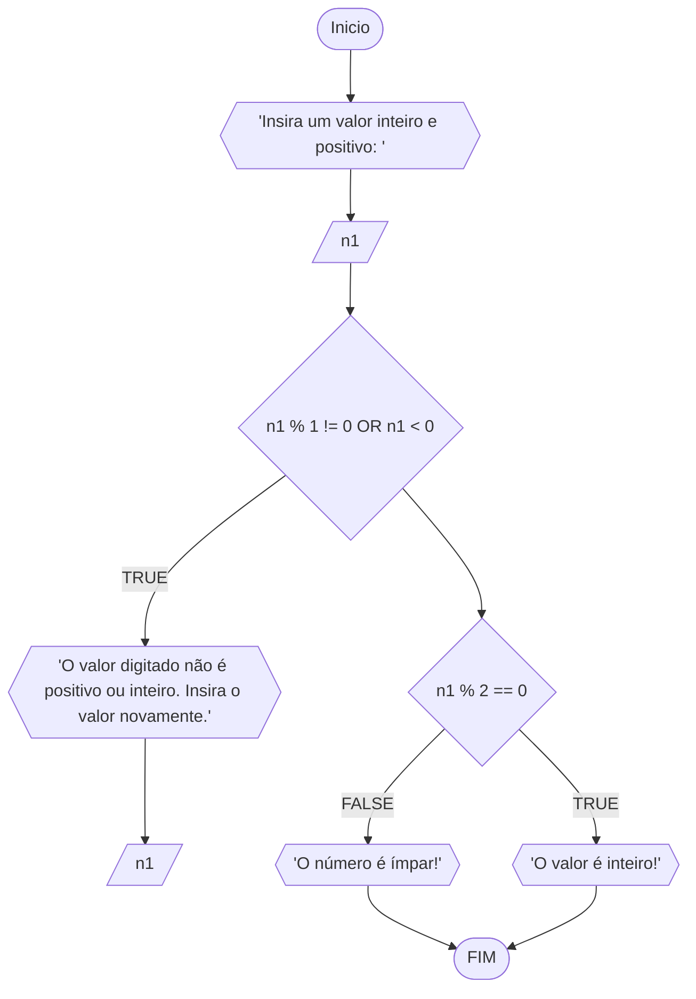
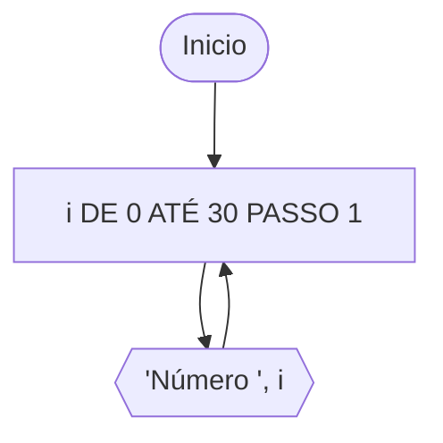

# Unifor
**Professor:**
**Disciplina:**


### Exercício 1:
Represente, em fluxograma e pseudocódigo, um algoritmo para determinar se um número inteiro e positivo é par ou impar.

#### Fluxograma:



#### Pseudocódigo:

```
ALGORITMO par_impar
DECLARE n1: INTEIRO
INICIO
ESCREVA "Insira um valor inteiro e positivo: "
LEIA n1
ENQUANTO n1 != 0 and n1 < 0 FAÇA
  ESCREVA "O valor digitado precisa ser inteiro e positivo. Insira o valor novamente: "
  LEIA n1
FIM_ENQUANTO
SE n1 % 2 == 0 ENTAO
  ESCREVA "O valor é par!"

SENAO
  ESCREVA "O valor é ímpar!"

```

#### Teste de mesa


### Exercício 2:
Faça um algoritmo que exiba na tela uma contagem de 0 até 30, exibindo apenas os múltiplos de 3.

#### Fluxograma:




