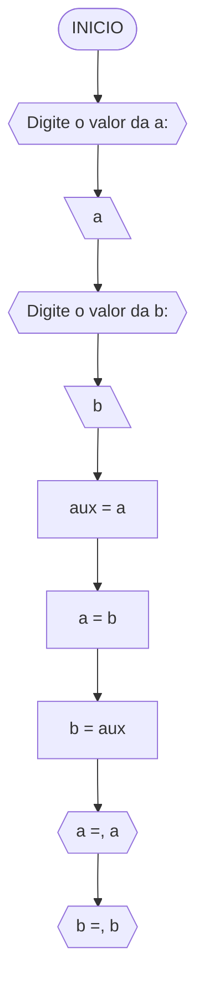
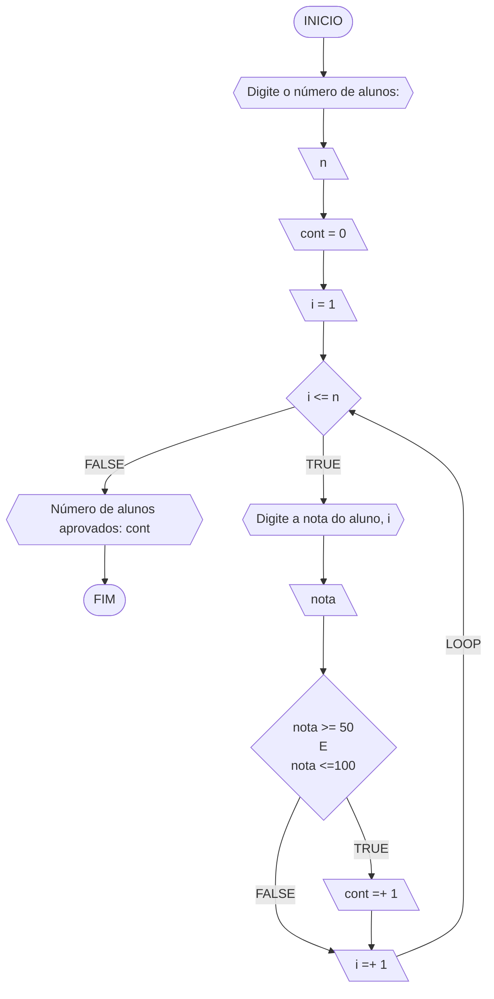
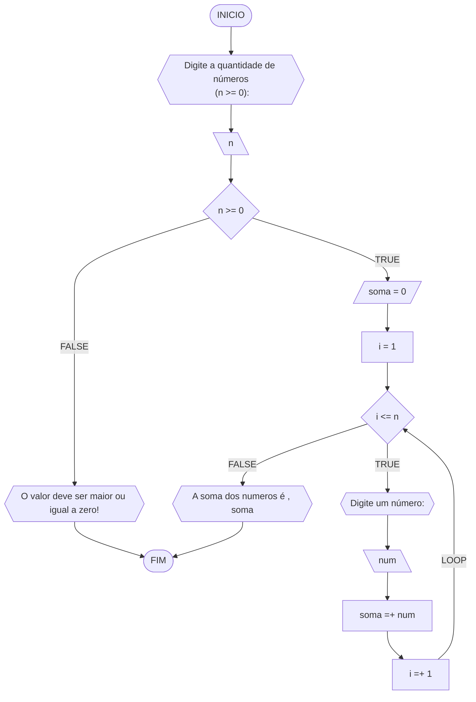
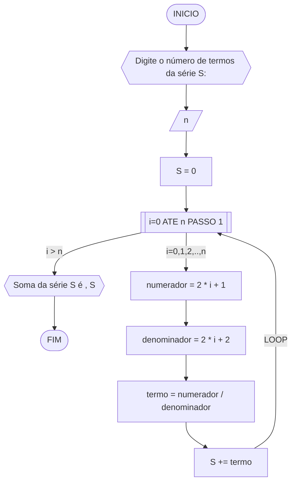
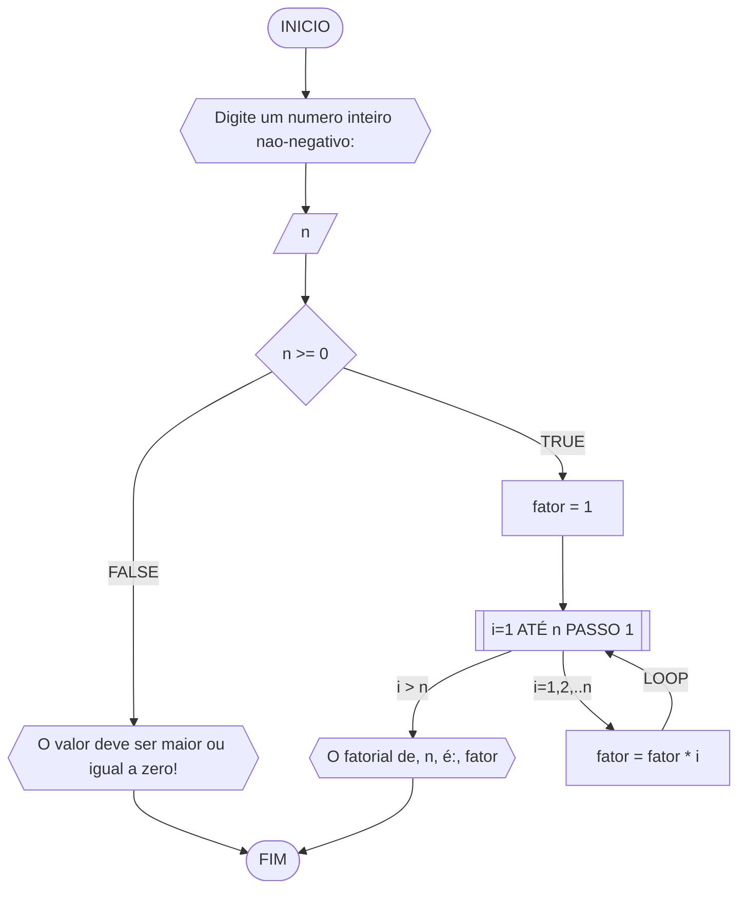
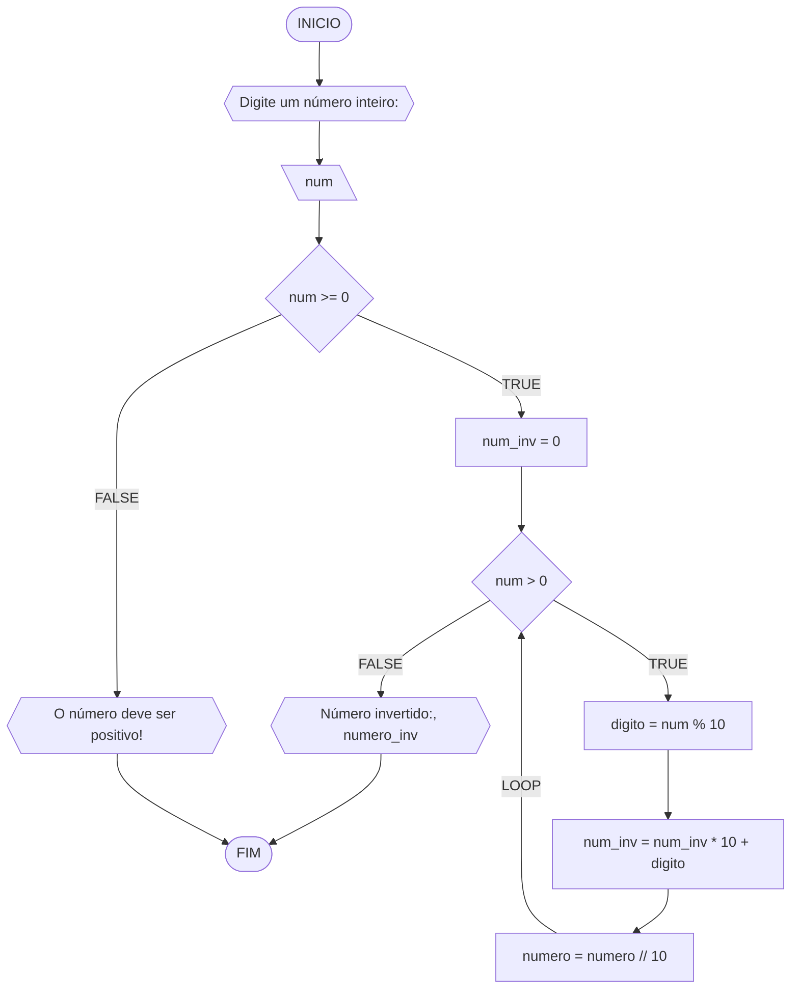

**Curso:** Ciência da Computação <br>
**Disciplina:** Raciocínio Lógico e Algorítmico <br>
**Código/Turma:** preencha com seus dados <br>
**Professor:** Ricardo Carubbi <br>
**Data:** 21/03/2024 <br>
**Aluno(a):** Francisco Luã Lima Cruz <br>
**Matrícula:** 2413102 <br>

**1a chamada (Sim/Não):** Sim <br>
**2a chamada (Sim/Não):** Não

## Questão 1 - Troca dos valores de duas variáveis (1 ponto)
Dadas duas variáveis, $a$ e $b$, implemente e teste um algoritmo para trocar os valores atribuídos a elas.

#### Fluxograma:



### Pseudocódigo:

```
ALGORITMO TrocaValores
DECLARE a, b, aux: FLOAT
INICIO
ESCREVA "Digite o valor de a: "
LEIA a
ESCREVA "Digite o valor de b: "
LEIA b
aux <- a
a <- b
b <- a
ESCREVA "a = ", a
ESCREVA "b = ", b
FIM

```

### Teste de mesa:

| a  | b  | aux | a  | b  | saída 1 | saída 2 | 
| -- | -- | --  | -- | -- | --      | --      | 
| 0  | 1  | 0   | 1  | 0  | a = 1   | b = 0   |

## Questão 2 - Contagem 
Dado um conjunto $n$ de notas de alunos em um exame, implemente e teste um algoritmo para fazer uma contagem $cont$ do número de alunos que foram aprovados no exame. 
Será considerado aprovado o aluno que tirar $nota$ 50 ou maior (no intervalo de 0 a 100).

#### Fluxograma:



#### Pseudocódigo:

```
DECLARE i, cont, n: INT
DECLARE nota: FLOAT
INICIO
ESCREVA "Digite o número de alunos: "
LEIA n
i <- 1                // Variável que controla o While
cont <- 0             // Conta quantos alunos foram aprovados
ENQUANTO i <= n FAÇA  // Isso fará 'n' repetições (Ex. 50 pedidos de notas)
  ESCREVA "Digite a nota do aluno ", i
  LEIA nota
  SE nota >= 50 AND nota <=100
    cont <- cont + 1
    i <- i + 1
  SENAO
    i <- i + 1
  FIM_SE
FIM_ENQUANTO
ESCREVA "O número de alunos aprovados foram: ", cont
FIM
```

#### Teste de mesa:
```
| it | n  | i  | cont | i<=n  | nota, i | nota | nota_valida | cont+1 | i+1 | saída        | 
| -- | -- | -- | --   | --    | --      | --   | --          | --     | --  | --           |
| 1  | 3  | 1  |  0   | True  | nota 1  | 60   | True        | 1      | 2   |              |
| 2  | 3  | 2  |  1   | True  | nota 2  | 40   | False       | 1      | 3   |              |
| 3  | 3  | 3  |  1   | True  | nota 3  | 90   | True        | 2      | 4   |              |
| 4  | 3  | 4  |  2   | False |         |      |             |        |     | Aprovados: 2 |
```
#### Questão 3 - Soma de um conjunto de números (1 ponto)

Dado um conjunto de $n$ números, implemente e teste um algoritmo para calcular a soma desses números. <br>
Aceite apenas $n$ maior ou igual a zero.

#### Fluxograma



#### Pseudocódigo:

```
ALGORITMO SomaSerie
DECLARE n, i: INT
DECLARE soma, num: FLOAT
ESCREVA "Digite a quantidade de números (n>=0): "
LEIA n
SE n >= 0 ENTAO
  soma <- 0
  i <- 1  // Controle do While (Permite executar fazer iterações até que a condição seja falsa)
  ENQUANTO i <= n FAÇA
    ESCREVA "Digite um número: "
    LEIA num
    soma <- soma + num
    i <- i + 1
  FIM_ENQUANTO
  ESCREVA "A soma dos números é: ", soma
SENAO
  ESCREVA "O número deve ser maior que zero!"
FIM_SE

```
#### Teste de mesa:

```
| it | n  | n >= 0 | soma | i  | i <= n | num | soma =+ num  | saída                   |
| -- | -- | --     | --   | -- | --     | --  | --           | --                      |
|    | -3 | False  |      |    |        |     |              | O valor deve ser ...    |
| 1  | 0  | True   | 0    | 1  | False  |     |              | A soma dos números é 0  |
| 1  | 3  | True   | 0    | 1  | True   | 5   | 0 + 5 = 5    |                         |
| 2  | 3  | True   | 5    | 2  | True   | 10  | 5 + 10 = 15  |                         |
| 3  | 3  | True   | 15   | 3  | True   | 20  | 15 + 20 = 35 |                         |
| 4  | 3  | True   | 35   | 4  | False  |     |              | A soma dos números é 35 |

```

## Questão 4 - Cálculo de uma série

Dado um conjunto de $n$ termos da série, implemente e teste um algoritmo para calcular o valor de S, conforme definido abaixo:

$$ S = \frac{1}{2} + \frac{3}{4} + \frac{5}{6} + \frac{7}{8} + \dots $$

#### Fluxograma:



#### Pseudocódigo:

```
ALGORITMO SomaSerie
DECLARE n: INT
DECLARE soma, numerador, denominador, termo: FLOAT
INICIO
ESCREVA "Digite o número de termos da série S: "
LEIA n
S <- 0
PARA i de 0 ATÉ n PASSO 1
  numerador <- 2*i + 1
  denominador <- 2*i + 2
  termo = numerador / denominador
  S <- S + termo
FIM_PARA
ESCREVA "Soma da série S é: ", S
FIM
```

#### Teste de mesa:
```
| it | n  | S  | i | numerador | denominador | termo | S += termo     | saída                  |
| -- | -- | -- |-- | --        | --          | --    | --             | --                     |
|    | 0  | 0  |   |           |             |       |                |                        |
| 1  | 4  | 0  | 0 | 2*0+1 = 1 | 2*0+2 = 2   | 1/2   | 0+1/2 = 1/2    |                        |
| 2  | 4  | 0  | 1 | 2*1+1 = 1 | 2*1+2 = 2   | 3/4   | 1/2+3/4 = 1.25 |                        |
| 3  | 4  | 0  | 2 | 2*2+1 = 1 | 2*2+2 = 2   | 5/6   | 0+1/2 = 2.08   |                        |
| 4  | 4  | 0  | 3 | 2*3+1 = 1 | 2*3+2 = 2   | 7/8   | 0+1/2 = 2.96   | Soma da série S é 2.96 |
```

## Questão 5 - Cálculo fatorial

Dado um número $n$, implemente e teste um algoritmo para calcular o fatorial de $n$ (escrito como $n!$), onde $n ≥ 0$.

#### Fluxograma



#### Pseudocódigo:

```
ALGORITMO CalcFatorial
DECLARE n, fator: INT
INICIO
ESCREVA "Digite um número inteiro nao-negativo: "
LEIA n
SE n >= 0 ENTAO
  fator <- 1  // É
  PARA i DE 1 até n
    fator <- fator * i
  FIM_PARA
  ESCREVA "O vatorial de ", n, " é: ", fator

SENAO
  ESCREVA "O valor deve ser maior ou igual a zero!
FIM_SE
FIM
```

#### Teste de mesa:

```
| n  | fator | i  | fator = fator * i | saída               |
| -- | --    | -- | --                | --                  |
| 3  | 1     | 1  | 1*1 = 1           |                     |
| 3  | 1     | 2  | 1*2 = 2           |                     |
| 3  | 2     | 3  | 2*3 = 6           | O fatorial de 3 é 6 |
```

## Questão 6 - Geração da sequência de Fibonacci
Gerar e imprimir os $n$ primeiros termos da sequência de Fibonacci, onde $n ≥ 1$. <br>
Os primeiros termos são: $0, 1, 1, 2, 3, 5, 8, 13, \dots$. Cada termo, além dos dois primeiros, é derivado da soma dos seus dois antecessores mais próximos.


#### Pseudocódigo:
```
ALGORITMO GeraFibonacci
DECLARE a, b, n, termo_atual: INT
ESCREVA "Digite o número de termos da série de Fibonacci: "
LEIA n
a <- 0
b <- 1
PARA i DE 0 ATÉ n PASSO 1
  ESCREVA a
  termo_atual = a + b
  a <- b
  b <- termo_atual
FIM_PARA
FIM
```

#### Teste de mesa:


| it | n  | a  | b  | i  | saída | termo_atual = a + b | a = b | b = termo_atual |
| -- | -- | -- | -- | -- | --    | --                  | --    | --              |
| 1  | 5  | 0  | 1  | 1  | 0     | 0 + 1 = 1           | 1     | 1               |
| 2  | 5  | 1  | 1  | 2  | 1     | 1 + 1 = 2           | 1     | 2               |
| 3  | 5  | 1  | 2  | 3  | 1     | 1 + 2 = 3           | 2     | 3               |
| 4  | 5  | 2  | 3  | 4  | 2     | 2 + 3 = 5           | 3     | 5               |
| 4  | 5  | 3  | 5  | 5  | 3     | 3 + 5 = 8           | 5     | 8               |

## Questão 7 - Inversão dos dígitos de um número inteiro
Implemente e teste um algoritmo para inverter a ordem dos dígitos de um número inteiro positivo.

#### Fluxograma


#### Pseudocódigo

```
ALGORITMO InverteInteiro
DECLARE num, num_inv, digito: INT
INICIO
ESCREVA "Digite um número inteiro: "
LEIA num
SE num >= 0 ENTAO
  num_inv <- 0
  ENQUANTO num > 0 FAÇA
    digito <- num % 10 // Pega o resto do número (Ex. 14 --> 4)
    num = num // 10  // Pega a parte inteiro do número (Ex. 14 --> 1)
    num_inv <- num_inv*10 + digito
  FIM_ENQUANTO
  ESCREVA "Número invertido: ", num_inv
SENAO
  ESCREVA "O número deve ser positivo!"
FIM_SE

```

#### Teste de mesa

| it | num | num_inv | num > 0 | digito | num = num // 10 | num_inv = (num_inv * 10) + digito | Saída                       |
| -- | --  | --      | --     | --      | --              | --                                | --                          |
|    | -1  | 0       | False  |         |                 |                                   | O número deve ser positivo! |
| 1  | 0   | 0       | False  |         |                 |                                   | Número invertido:: 0        |
| 1  | 42  | 0       | True   | 2       | 4               | 2                                 |                             |
| 2  | 4   | 2       | True   | 4       | 0               | 24                                |                             |
| 3  | 0   | 24      | False  |         |                 |                                   | Número invertido:: 24       |
