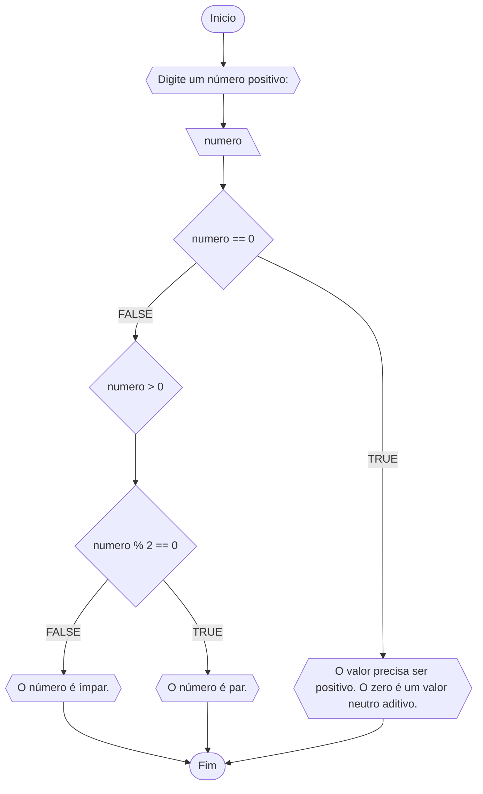

# Unifor:

**Nome:** Francisco Luã <br>
**Disciplina:** Raciocínio lógico algorítmico

## Lista de exercícios 01

### Exercício 01
Represente, em fluxograma e pseudocódigo, um algoritmo para determinar se um número inteiro e positivo é par ou impar.

##### Fluxograma:



#### Pseudocódigo:

```
ALGORITMO verif_par_impar
DECLARE numero: INTEIRO
ESCREVA "Digite um número: "
INICIO
LEIA numero

SE numero == 0 ENTAO
  ESCREVA "O número deve ser positivo. O número zero não é positivo e nem negativo; é elemento neutro aditivo."

SENAO
  SE numero > 0 ENTAO
    SE numero % 2 == 0 ENTAO
      ESCREVA "O número é par."
    SENAO
      ESCREVA "O número é ímpar."
    FIM_SE

  SENAO
    ESCREVA "O número precisa ser positivo."
  FIM_SE
FIM_SE
FIM

```

#### Teste de mesa:
| numero | numero == 0 |numero > 0 | numero % 2 == 0 | Saída |
| -- | ---  | -- | -- | ----  |
| -1 | F | F |  |"O número deve ser positivo." |
| 0  | V | F |  | "O número deve ser positivo. O 0 é elemento neutro aditivo." |
| 15 | F | V | F | "O número é ímpar." |
| 16 | F | V | V | "O número é par." |

