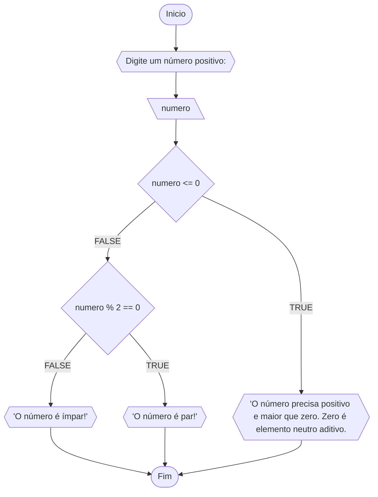
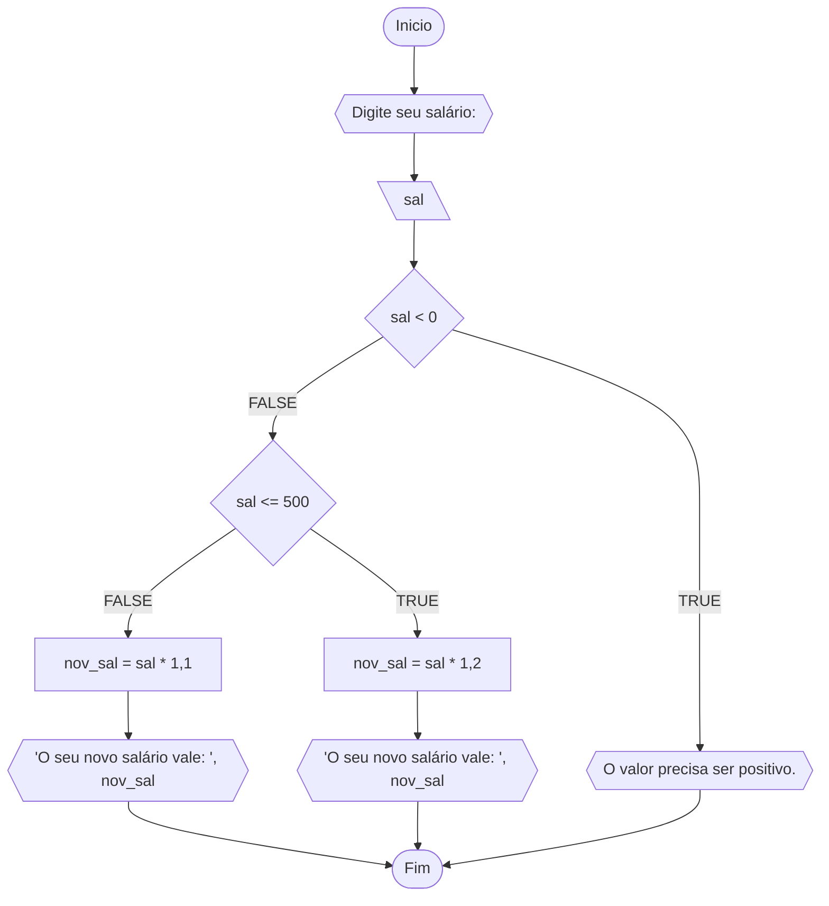
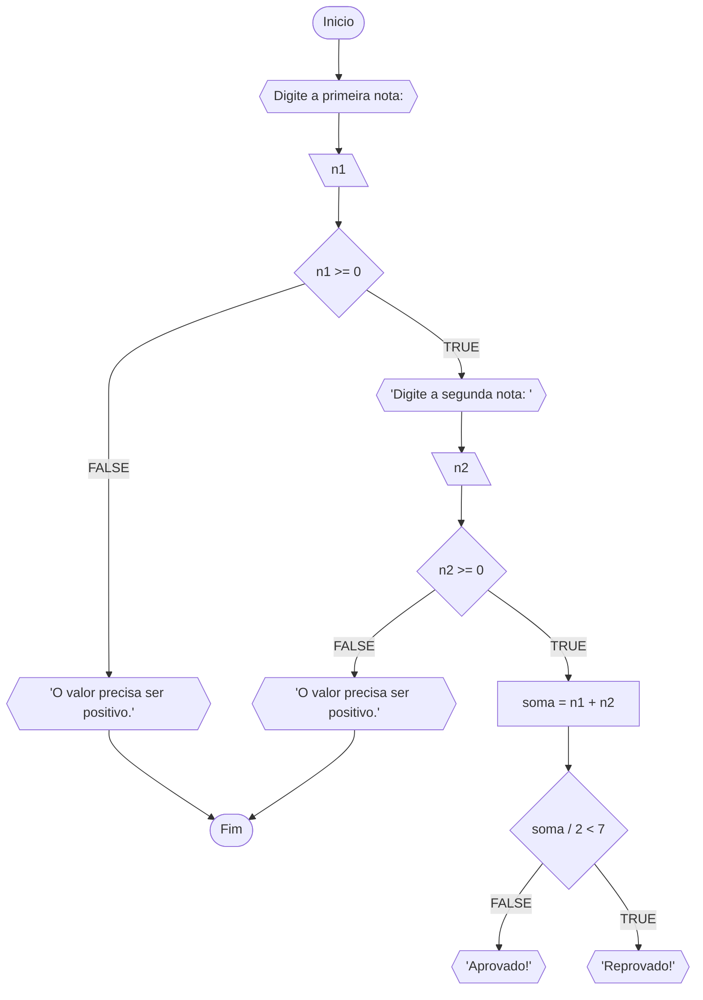
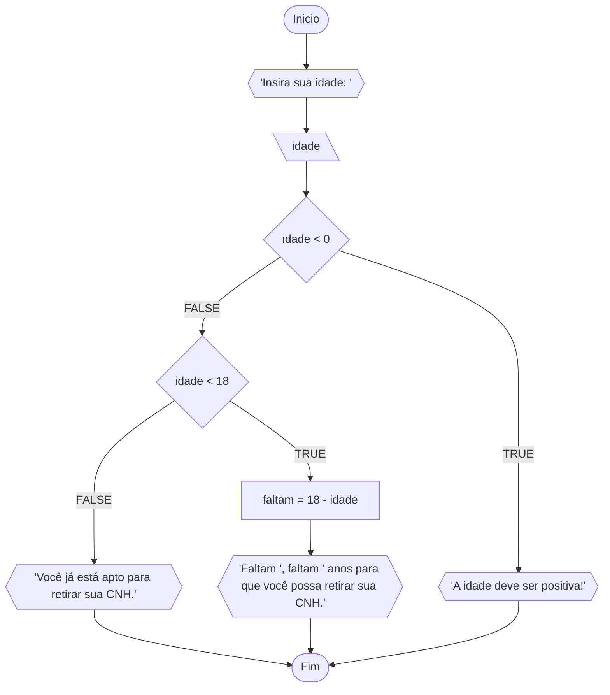

# Unifor

**Nome:** Francisco Luã <br>
**Disciplina:** Raciocínio lógico algorítmico

## Lista de exercícios 01

### Exercício 01
Represente, em fluxograma e pseudocódigo, um algoritmo para determinar se um número inteiro e positivo é par ou impar.

##### Fluxograma:




#### Pseudocódigo:

```
ALGORITMO verif_par_impar
DECLARE numero: INTEIRO
INICIO
ESCREVA "Digite um número: "
LEIA numero

SE numero <= 0 ENTAO
  ESCREVA "O número precisa ser positivo e maior que zero (zero é elemento neutro aditivo)."

SENAO
  SE numero % 2 == 0 ENTAO
    ESCREVA "O número é par."
  SENAO
    ESCREVA "O número é ímpar."
    FIM_SE
FIM_SE
FIM

```

#### Teste de mesa:
| numero | numero <= 0 | numero % 2 == 0 | Saída |
| -- | ---  | -- | -- | 
| -1 | V |  | "O número precisa ser positivo e maior que zero (zero é elemento neutro aditivo)." |
| 0  | V |  | "O número precisa ser positivo e maior que zero (zero é elemento neutro aditivo)." |
| 15 | F | F | "O número é ímpar." |
| 16 | F | V | "O número é par." |

### Exercício 02

Represente, em fluxograma e pseudocódigo, um algoritmo para calcular o novo salário de um funcionário. Sabe-se que os funcionários que recebem atualmente salário de até R$ 500 terão um aumento de 20%; os demais terão aumento de 10%.

##### Fluxograma:



#### Pseudocódigo:

```
ALGORITMO calcula_novo_salario
DECLARE sal, nov_sal: FLOAT
ESCREVA "Digite seu salário"
INICIO
LEIA sal
SE sal < 0 ENTAO
  ESCREVA "Seu salário deve ser positivo"

SENAO
  SE sal <= 500 ENTAO
    nov_sal = sal * 1,2
    ESCREVA "O seu novo salário vale: ", nov_sal

  SENAO
    nov_sal = sal * 1,1
  FIM_SE
FIM_SE
FIM
```

#### Teste de mesa:

| sal | sal < 0 | sal <= 500 | Saída |
| -- | -- | -- | -- |
| -5 | V | | "O valor precisa ser positivo."|
| 100 | F | V | "O seu novo salário vale: 120" |
| 1000 | F | F | "O seu novo salário vale: 1100" |

### Exercício 03

Represente, em fluxograma e pseudocódigo, um algoritmo para calcular a média aritmética entre duas notas de um aluno e mostrar sua situação, que poe ser aprovado ou reprovado.

#### Fluxograma:



#### Pseudocódigo:

```
ALGORITMO aprovado_reprovado
DECLARE n1, n2, soma: FLOAT
INICIO
ESCREVA "Insira sua primeira nota: "
LEIA n1
SE n1 >= 0 ENTAO
  ESCREVA "Insira sua segunda nota: "
  LEIA n2
  SE n2 >= 0 ENTAO
    soma = n1 + n2
    SE soma / 2 < 7 ENTAO
      ESCREVA "Aprovado!"

    SENAO
      ESREVA "Reprovado!"
    FIM_SE
  SENAO
    ESCREVA "A segunda nota precisa ser maior ou igual a zero!"
  FIM_SE

SENAO
  ESCREVA "A primeira nota precisa ser maior o igual a zero!"
FIM_SE
FIM  
```

#### Teste de mesa:

| n1 | n1 > 0 | n2 | n2 > 0 | soma | soma / 2 < 7 | Saída |
| -- | -- | -- | -- | -- | -- | -- |
| -1 | F | | | | | "A primeira nota precisa ser maior ou igual a zero!"|
| 5 | V | -2 | F | | | "A segunda nota precisa ser maior ou igual a zero!"|
| 5 | V | 6 | V | 11 | 5.5 | "Reprovado!" |
| 10 | V | 10 | V | 20 | 10 | "Aprovado!" |

### Exercício 04
Represente, em fluxograma e pseudocódigo, um algoritmo que, a partir da idade da(o) candidata(o), determinar se pode ou não tirar a CNH. Caso não atender a restrição de idade, calcular quantos anos faltam para a(o) candidata(o) estar apta(o).

##### Fluxograma:



#### Pseudocódigo:

```
ALGORITMO Calcula_idade_CNH
DECLARE idade, faltam: INTEIRO
INICIO
ESCREVA "Insira sua idade: "
LEIA idade
SE idade < 0 ENTAO
  ESCREVA "A idade deve ser positiva!"

SENAO
  SE idade < 18 ENTAO
    faltam = 18 - idade
    ESCREVA "Faltam ", faltam, " anos para que você possa retirar sua CNH."
  SENAO
    ESCREVA "Você já está apto para retirar sua CNH."
  FIM_SE
FIM_SE
```

#### Teste de mesa:

| idade | idade < 0 | idade < 18 | faltam | Saída |
| --- | --- | --- | --- | --- |
| -5 | V | | | "A idade deve ser positiva" |
| 2 | F | V | 18 - 2 = 16 | "Faltam 16 anos para que você possa retirar sua CNH." |
| 18 | F | F | | "Você já está apto a retirar sua CNH."|


