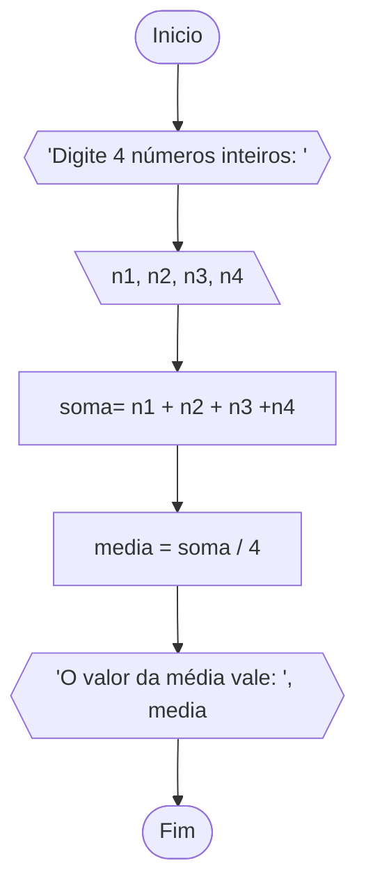
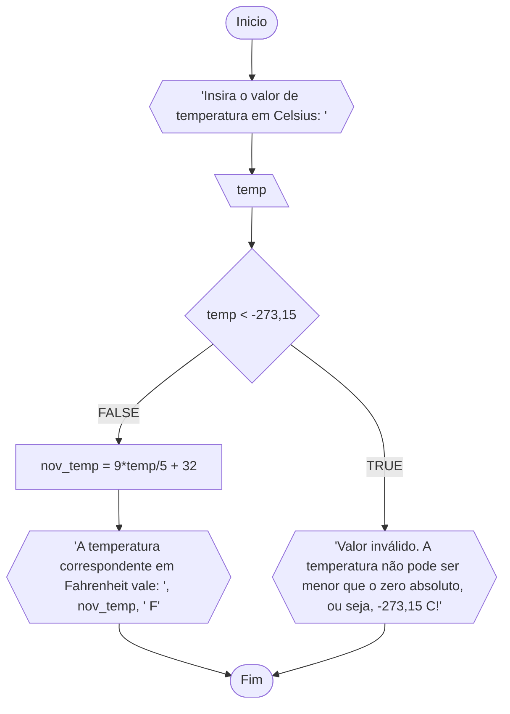
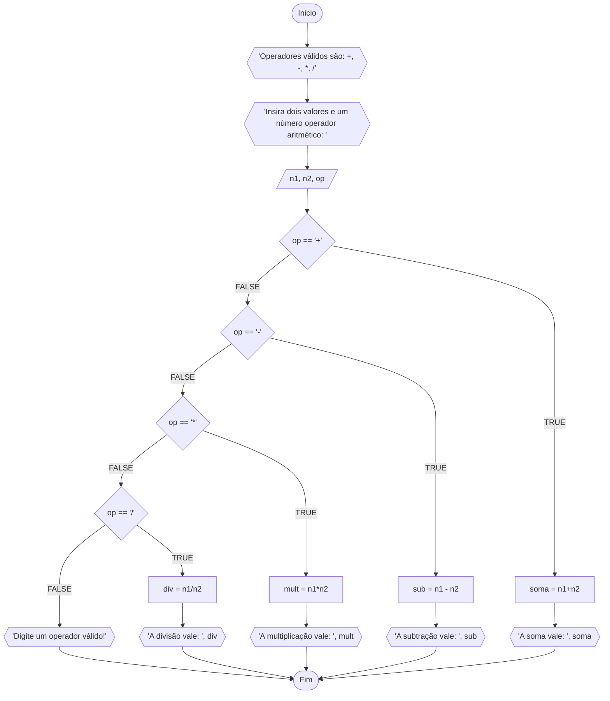
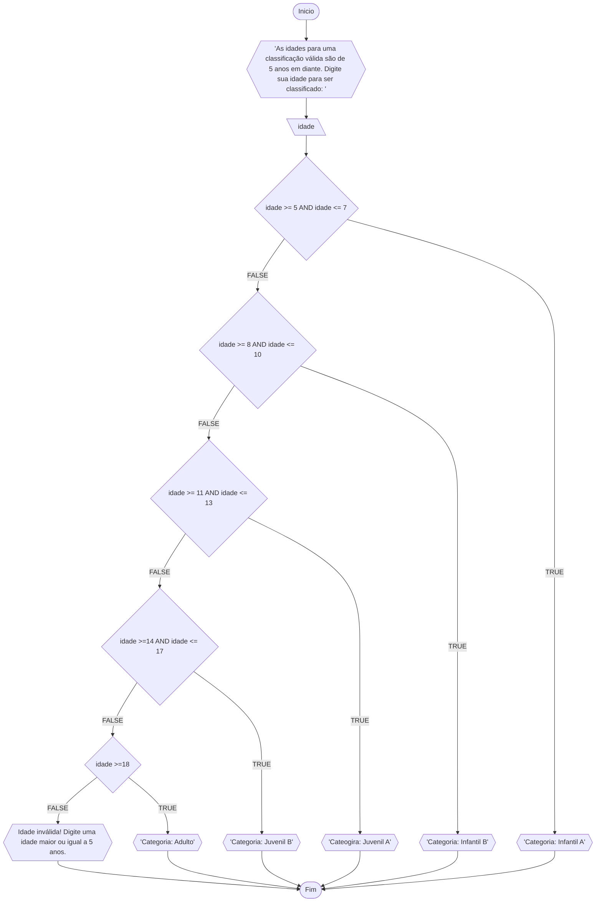

# Unifor
**Nome:** Francisco Luã Lima Cruz <br>
**Disciplina:** Raciocínio lógico e algoritmo

## Exercício 01
Calcule a média de quatro números inteiros dados

### Fluxograma:



### Pseudocódigo:
```
ALGORITMO Media
DECLARE n1, n2, n3, n4, soma: INT
DECLARE media: FLOAT
ESCREVA "Digite 4 números inteiros: "
INICIO
LEIA n1, n2, n3, n4
soma = n1 + n2 + n3 + n4
media = soma/4
ESCREVA "A média vale: ", media
FIM
```

### Teste de mesa:

| n1 | n2 | n3 | n4 | soma | media | saída |
| -- | -- | -- | -- | -- | -- | -- |
| 0 | 5 | 3 | 7 | 15 | 7.5 | "A média vale: 7.5" |

## Exercício 02
Leia uma temperatura dada em Celsius (C) e impriida o equivalente em Fahrenheint (F). (Fórmmula de conversão: F = (9/5)*C + 32)

### Fluxograma:



### Pseudocódigo:

```
ALGORITMO ConverteCelsiusFarenheint
DECLARE temp, nov_temp: FLOAT
ESCREVA "Insira o valor de temperatura em Celsius: "
LEIA temp
SE temp < -273,15 ENTAO
  ESCREVA "Valor inválido. A temperatura não pode ser menor que o zero absoluto, ou seja, -273,15 C!"
SENAO
  nov_temp = 9*temp/5 + 32
  ESCREVA "A temperatura correspondente em Fahrenheit vale: ", nov_temp, " F"
FIM_SE
FIM

```

### Teste de mesa:

| temp | temp < -273,15 | nov_temp | saída |
| -- | -- | -- | -- |
| -300 | V | | "Valor inválido. A temperatura não pode ser menor que o zero absoluto, ou seja, -273,15 C!" |
| 5 | F | 41.0 | "A temperatura correspondente em Fahrenheit vale: 41.0 F."|

## Exercício 03
Recebe dois números e um operador e efetue a operação corresondente com os valores recebidos (operandos). O aloritmo deve retornar o resultado da operação selecionada simulando todas as operações de uma calculadora simples.



### Pseudocódigo:

```
ALGORITMO Calculadora
DECLARE n1, n2, soma, mult, div: FLOAT
DECLARE op: INTEIRO
ESCREVA "Operadores válidos são: +, - , *, /"
ESCREVA "Insira dois valores e um número correspondente a um operador: "
SE op == '+' ENTAO
  soma = n1 + n2
  ESCREVA "A soma vale: ", soma

SENAO SE op == '-' ENTAO
  sub = n1 - n2
  ESCREVA "A subtração vale: ", sub

SENAO SE op == '*' ENTAO
  mult = n1 * n2
  ESCREVA "A multiplicação vale: ", mult

SENAO SE op == '/' ENTAO
  div = n1 / n2
  ESCREVA "A divisão vale: ", div

SENAO
  ESCREVA "Digite um operador válido!"

FIM_SE
FIM
```

### Teste de mesa:

| n1 | n2 | op | op == '+'| op == '-'| op == '*' | op == '/'| n1 + n2| n1 - n2| n1\*n2| n1/n2 | Saída |
| -- | -- | -- | -- | -- | -- | -- | -- | -- | -- | -- | -- |
| 1 | 2 | a | F | F | F | F | | | | | "Digite um operador válido!" |
| -5 | 6 | + | V | F | F | F | 1 | | | | "O valor da soma vale: 1"|
| 1 | 3 | - | F | V | F | F | | -2 | | | "O valor da subtração vale: -2"|
| 1 | 7 | *\ | F | F | V | F | | | 7 | | "O valor da multiplicação vale: 7"|
| 10 | 2 | / | F | F | F | V | | | | 5 | "O valor da divisão vale: 5" |


## Exercício 04
Elaborar um algoritmo que, dada a idadem classifique nas categorias: infantil A (5 - 7 anos), infantil B (8 - 10 anos), juvenil A (11 - 13 anos), juvenil B (14 - 17) e adulto (maiores que 18 anos).

### Fluxograma:



### Pseudocódigo:

```
ALGORITMO ClassificaCategoria
DECLARE idade
ESCREVA "As idades para uma classificação válida são de 5 anos em diante. Digite sua idade para ser classificado: "
INICIO
LEIA idade
SE idade >= 5 AND idade <= 7 ENTAO
  ESCREVA "Categoria: Infantil A"
SENAO SE idade >= 8 AND idade <= 10 ENTAO
  ESCREVA "Categoria: Infantil B"
SENAO SE idade >= 11 AND idade <= 13 ENTAO
  ESCREVA "Categoria: Juvenil A"
SENAO SE idade >= 14 AND idade <= 17 ENTAO
  ESCREVA "Categoria: Juvenil B"
SENAO SE idade >= 18 ENTAO
  ESCREVA "Categoria: Adulto"
SENAO
  ESCREVA "Idade inválida! Digite uma idade maior ou igual a 5 anos."
FIM_SE
FIM
```

### Teste de mesa:

| idade | idade >= 5 AND idade <= 7|idade >= 8 AND idade <=10 | idade >= 11 AND idade <= 13 | idade >=14 AND idade <= 17 | idade >= 18 | Saída |
| -- | -- | -- | -- | -- | -- | -- |
| 0 | F | F | F | F | F |"Idade inválida! Digite uma idade maior ou igual a 5 anos."
| 6 | V | F | F | F | F |"Categoria: Infantil A" |
| 9 | F | V | F | F | F |"Categoria: Infantil B" |
| 12 | F | F | V | F | F| "Categoria: Juvenil A" |
| 15 | F | F | F | V | F | "Categoria: Juvenil B" |
| 19 | F | F | F | F | V | "Categoria: Adulto" |

