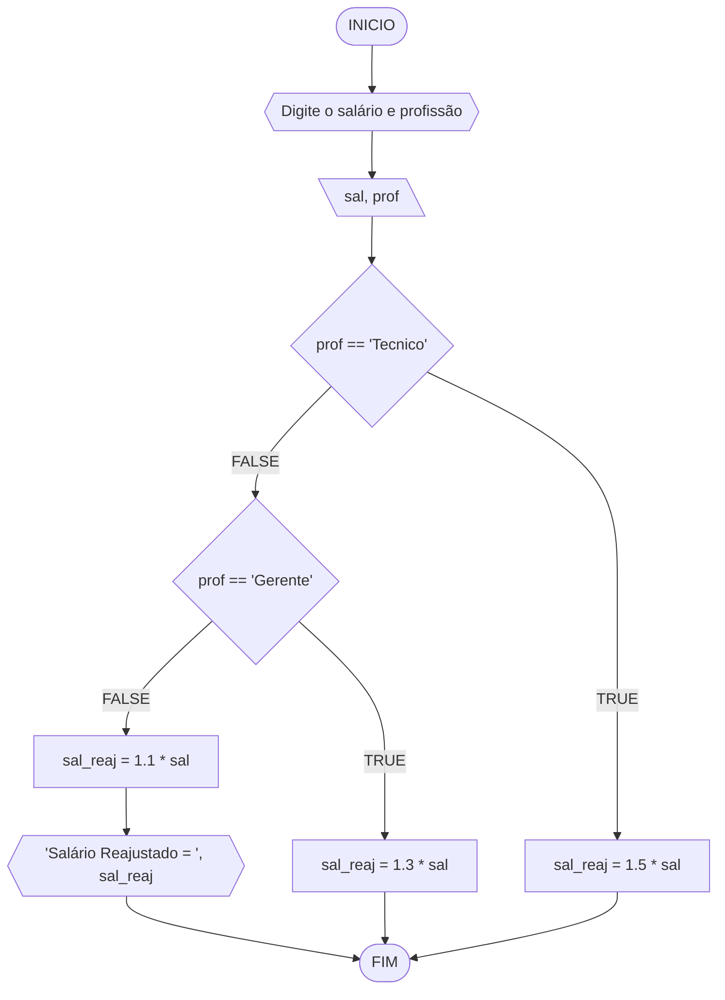

# Unifor
**Nome:** Francisco Luã Lima Cruz
**Disciplina:** Raciocínio lógico e algoritmo

## Exercício exemplo
Represente, em fluxograma e pseudocódigo, um algoritmo para calcular o adicional de salário de funcionário por cargo de uma empresa fictícia. Sabe-se que os funcionários de cargo técnico receberão reajuste de 50%, cargo de gerência, um reajuste de 30% e demais, um reajuste de 10%. 

#### Fluxograma


#### Pseudocódigo
```
1  ALGORITMO calReajuste
2  DECLARE  sal, sal_reaj: real, prof: caractere
3  INICIO
4  LEIA sal, prof
5  ESCOLHA
6   CASO prof == “Técnico”		// caso 1
7     sal_reaj ← 1.5 * sal
8   CASO prof = “Gerente”		// caso 2
9     sal_reaj ← 1.3 * sal
10  SENÃO
11    sal_reaj ← 1.1 * sal
12 FIM_ESCOLHA
13 ESCREVA “Salário Reajustado = “, sal_reaj
14 FIM
```

#### Teste
| sal | prof | prof == “Técnico” | prof = “Gerente” | sal_reaj | Saída |
| -- | -- | -- | -- | -- | -- |
| 1000 | Técnico | V | F | 1500 | “Salário Reajustado = 1500“ |
| 2000 | Gerente | F | V | 2600 | “Salário Reajustado = 2600“ |
| 9000 | Diretor | F | F | 9900 | “Salário Reajustado = 9900“ |
