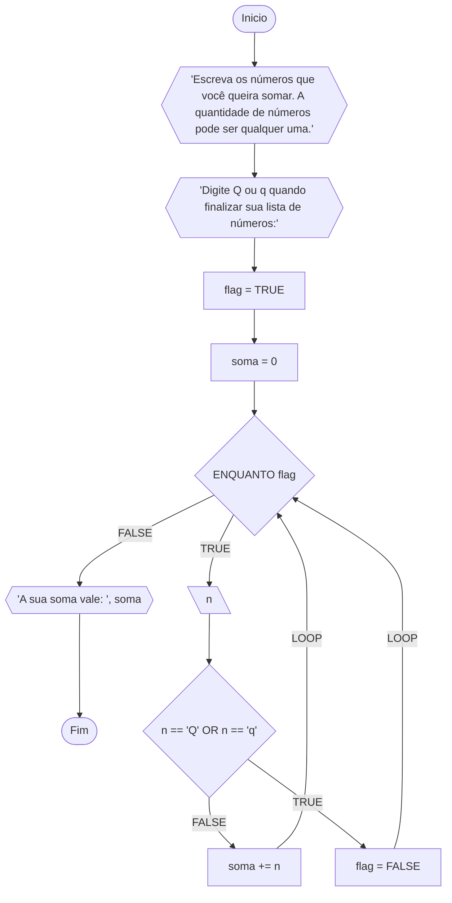
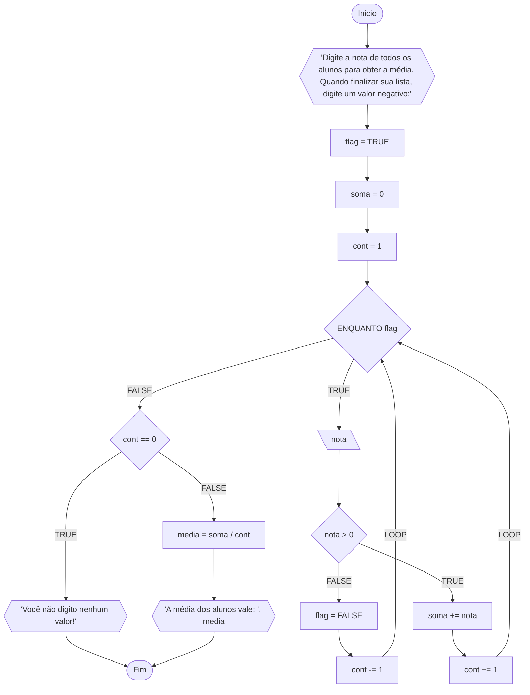

# Unifor
**Nome:** Francisco Luã Lima Cruz <br>
**Disciplina:** Raciocínio Lógico Algorítmico

## Exercício 01
Atualize o algoritmo para determinar se um número inteiro e positivo é par ou ímpar, usando um laço condicional para aceitar apenas números maiores ou iguais a zero.

### Fluxograma:


### Pseudocódigo:

```
ALGORITMO DeterminaParImpar
DECLARE n: INT

INICIO
ESCREVA "Digite um número inteiro e positivo: "
LEIA n
ENQUANTO n <= 0 FAÇA
  ESCREVA "O número deve ser maior que zero! Digite o valor novamente: "
  LEIA n
FIM_ENQUANTO

SE n % 2 == 0 ENTAO
  ESCREVA "O número é par!"
SENAO
  ESCREVA "O número é ímpar!"
FIM_SE
FIM
```

### Teste de mesa:

| n | n <= 0 | it | it: Saída | n % 2 == 0 | Saída |
| -- | -- | -- | -- | -- | -- |
| 0 | V | 1 | "O número deve ser maior que zero. Digite o valor novamente:  | | |
| -2 | V | 2 | "O número deve ser maior que zero. Digite o valor novamente:" | | |
| 5 | F | | | F | "O número é ímpar!"|
| 4 | F | | | V | "O número é par!" |

## Exercício 02
Faça um algoritmo que exiba na tela uma contagem de 0 até 30, exibindo apenas os múltiplos de 3.

### Fluxograma:


### Pseudocódigo:

```
ALGORITMO Print_Multiplos_De_3
ESCREVA "O programa irá exibir apenas múltiplos de 3, que estão entre 0 até 30, e incluindo 0 e 30."
INICIO
PARA i DE 0 ATÉ 30 PASSO 3 FAÇA
  ESCREVA "Número: ", i
FIM_PARA
FIM
```

### Teste de mesa:
| it | i | Saida |
| -- | -- | -- |
| 1 | 0 | "Número: 0" |
| 2 | 3 | "Número: 3" |
| 3 | 6 | "Número: 6" |
| 4 | 9 | "Número: 9" |
| 5 | 12 | "Número: 12" |
| 6 | 15 | "Número: 15" |
| 7 | 18 | "Número: 18" |
| 8 | 21 | "Número: 21" |
| 9 | 24 | "Número: 24" |
| 10 | 27 | "Número: 27" |
| 11 | 30 | "Número: 30" |

## Exercício 03
Dada uma sequência de números inteiros, calcular a sua soma. Por exemplo, para a sequência {12, 17, 4, -6, 8, 0}, o seu programa deve escrever o número 35.

### Fluxograma:



### Pseudocódigo:

```
ALGORITMO SomaListaNumeros
DECLARE flag: BOOL
DECLARE n, soma: FLOAT

INICIO
ESCREVA "Escreva os números que você queira somar. A quantidade de números pode ser qualquer uma."
ESCREVA "Digite Q ou q quando finalizar sua lista de números:"

flag <- TRUE 
soma <- 0
ENQUANTO flag
  LEIA n
  SE n == 'Q' OR n == 'q' ENTAO
    flag = FALSE
  SENAO
    soma += n
  FIM_SE
FIM_ENQUANTO
ESCREVA "Sua soma vale: ", soma
FIM
```

### Teste de mesa:

## Exercício 04

Escreva um programa que leia a nota de diversos alunos, até que seja digitada uma nota negativa. Nesse momento, ele mostra a média aritmética de todas as notas lidas e quantas notas foram lidas. Ex. Foram lidas 14 notas. A média aritmética é 6.75!

### Fluxograma:



### Pseudocódigo:

```
ALGORITMO Calcula_Media_Diversos_Alunos
DECLARE nota, soma, media: FLOAT
DECLARE cont: INT
DECLARE flag: BOOL
INICIO
cont <- 1
flag <- TRUE
ESCREVA "Digite a nota de todos os alunos para obter a média. Quando finalizar sua lista, digite um valor negativo: "
ENQUANTO flag FAÇA
  LEIA nota
  SE nota > 0 ENTAO
    soma <- soma + nota
    cont <- cont + 1

  SENAO
    flag <- FALSE
    cont <- cont - 1
  FIM_SE
SE cont == 0 ENTAO
  ESCREVA "Você não digitou nenhuma nota!"
SENAO
  media = soma / cont
  ESCREVA "A média dos alunos vale: , media"
FIM_SE
FIM
```

### Teste de mesa:

